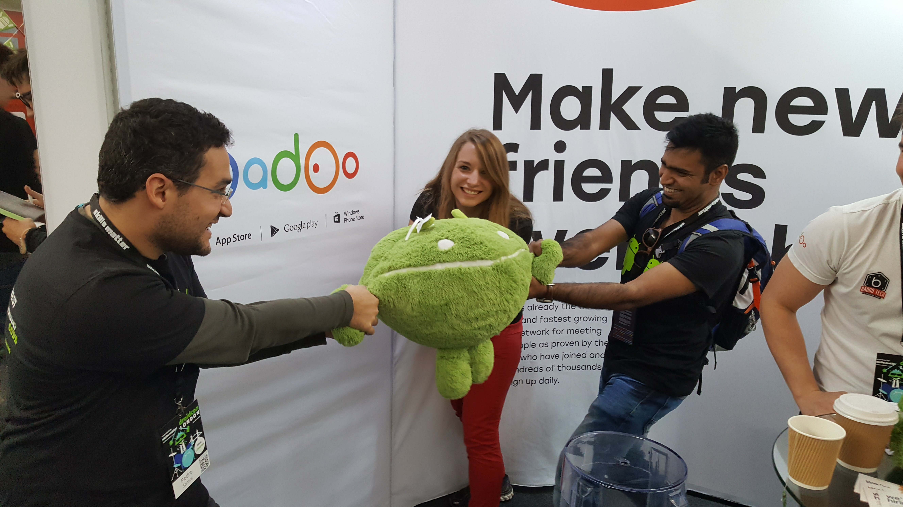
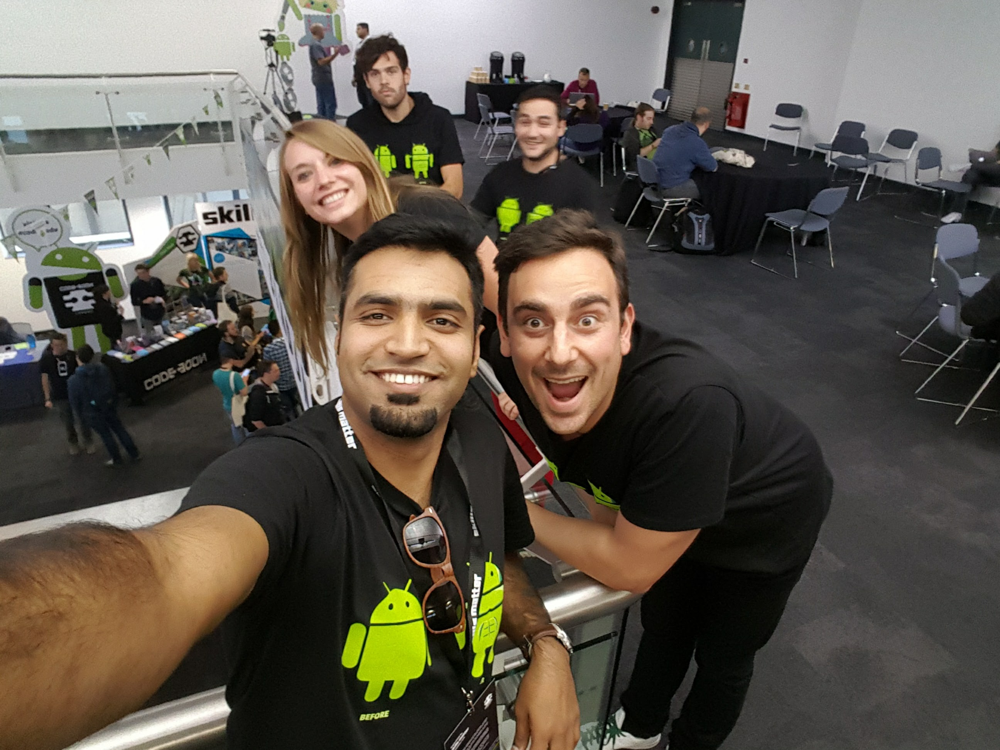
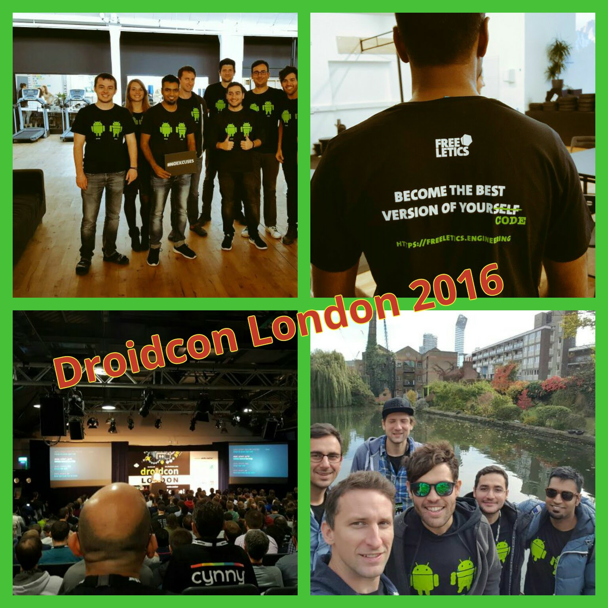
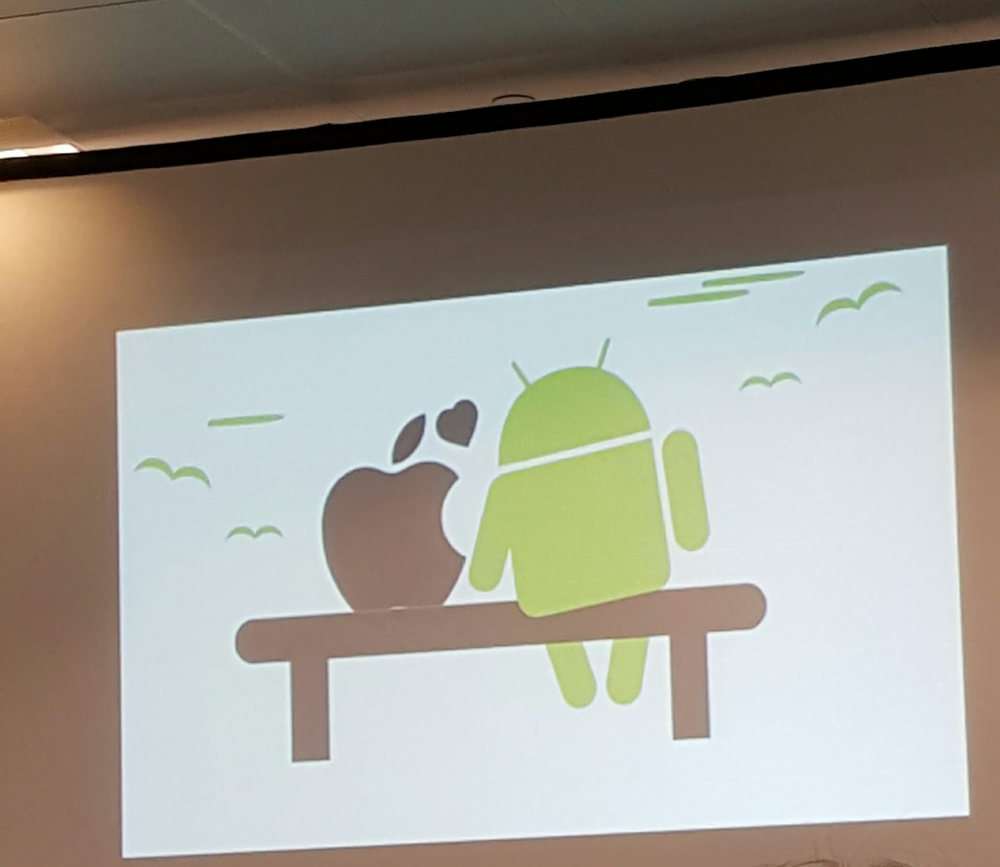
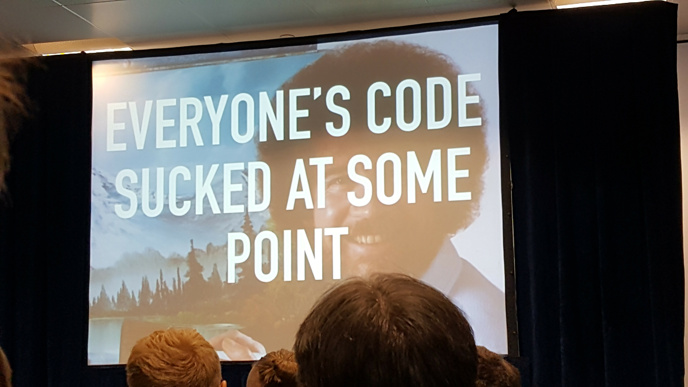

 

This is just a small effort to transform my handwritten notes to a blog post. They are just important points, tips and things which I noted for myself to be explored later. For the talks whose videos are already published, I have made the title as hyperlink so that you can watch directly. For rest, you can explore yourself [here](http://uk.droidcon.com/#program).

## [Designing the Design Support Lib](http://uk.droidcon.com/skillscasts/8417-designing-the-design-support-library)

 - Tintable Drawables : Read more details in the Google I/O Talk [#ToExplore](https://www.youtube.com/watch?v=TIHXGwRTMW)
 - Generating ActionBar
 - No Custom Drawables
   - LayoutInflator Factory [#ToExplore](http://blog.bradcampbell.nz/layoutinflater-factories/)

## [Layout Editor & Constraint Layout](http://uk.droidcon.com/skillscasts/8711-a-new-view-layout-editor-constraintlayout)

 - Difficult to understand relationships by just viewing xml 
 - beta 3 is now available!
 - Better use *Guidelines* to guide you in making right targets for Constraint
 - If child element in Constraint Layout is 'gong', it collapses and becomes zero actually
 - *Chains* are a cool thing. It's like Linear Layout and allows adjusting spaces between widgets horizontally or vertically. Different types of chanes are available.
 - It gives you power of avoiding nested heirarchies. Better performance! 
 - Checkout [Dave Smith](https://twitter.com/devunwired) blog ([part 1](http://wiresareobsolete.com/2016/07/constraintlayout-part-1/) & [part 2](http://wiresareobsolete.com/2016/07/constraintlayout-part-2/)) on Constraint Layout
 - Start using UI builder if not [#ToExplore](https://developer.android.com/studio/write/layout-editor.html)

## [Making fully Reactive apps using advanced RxJava](http://uk.droidcon.com/skillscasts/8678-making-fully-reactive-apps-using-advanced-rxjava) 
 
 - Presenter is self-contained & handle it's own lifecycle -> breaks the rule but useful!
 - Rxlifecycle in Detail [#ToExplore](https://github.com/trello/RxLifecycle) 
 - State can be implemented by BehaviorSubject
 - [RxAndroidLibs](https://github.com/zsoltk/RxAndroidLibs) : A curated list of libraries to aid reactive development on Android
 - Avoid cycling dependencies
 - Never keep a strong reference to the view
 - Use RxRelays instead of Subjects
 - Allow errors to happen gracefully -> "Log and Swallow" approach

 
## Retrolambda (Lightning Talk)
 
 - Jack & Jill compiler [#ToExplore](http://trickyandroid.com/the-dark-world-of-jack-and-jill/)
 - Avoid annonymous classes 
 - User Method References
 - Performance -> Watch Jack Wharton [talk](https://realm.io/news/360andev-jake-wharton-java-hidden-costs-android/)
 
## Writing a Library (Lightning Talk)
 
 - Motivating factors for devs: Challenge, Better Documentation, Something to share, Help you finding a better job, Code Quality etc
 - Why companies should do it? 
   -  Help in attracting better devs
   -  You'll get help from other engineers
   -  Even disney has an open source strategy :)
   -  Choose the correct license
   -  If want to avoid legal problems, try even releasing under a separate organization. 
   -  Publish -> Maven Central, JCenter or [jitpack.io](https://jitpack.io)
   -  Promoting -> Android Arsenal, Android Weekly, Slack communities, Reddit, Twitter etc
   
   
## [What's new in Android](http://uk.droidcon.com/skillscasts/8414-what-s-new-in-android) 

- Test Recorder with Espresso [#ToExplore](https://developer.android.com/studio/test/espresso-test-recorder.html)
- Constraint Layout
- APK Analyzer [#ToExplore](https://developer.android.com/studio/build/apk-analyzer.html)
- Google Play Services -> Google Fit Goals [#ToExplore](https://developers.google.com/android/reference/com/google/android/gms/fitness/GoalsApi)

## Rx Recipe

- Non-reactive alternate to Rx => Guava (Data Flow) + Otto (EventBus)  
- Alternatives of RxJava
  - Project Reactor
  - Google Agera: slow, buggy, non-tested
- Java 8 Streams are quick but not reactive!

## [Building Overlay SOKs on Android](https://skillsmatter.com/skillscasts/9312-building-overlay-soks-on-android-the-two-minutes-integration-challenge#showModal?modal-signup-complete)

- Various approaches to implement Overlays in Android inclues using 1) [Windows Manager](https://developer.android.com/reference/android/view/WindowManager.html), WindowTokens, 2) Overlay with a new DecorView child
- Facebook chat heads use *SystemWindows* which are special types of windows used by the system for specific purposes.
- Info: An Activity won't crash if setContentview() is not included. Why? It will inflate with the most simple layout `screen_simple.xml` managed by `PhoneWindow` class. 
- Info: use `addContentView()` to overlay views. There's a minor difference between `setContentView()` and `addContentView()` which is that it doesn't remove any previously added views.
- Choose the right format for your [lib](https://developer.android.com/studio/projects/android-library.html). Options are JAR/apklib/AAR and officially supported way is to use AAR. Unlike JAR files, AAR files can contain Android resources and a manifest file, which allows you to bundle in shared resources like layouts and drawables in addition to Java classes and methods.
- Tip: Expose an interface for library. Don't do ninja code to recursively add parameters for each request for developers (users). Better use some Design Pattern.
- Tip: Give devs a way to test the behavior of our library. Better give them back the power by offering `ParamsBuilder`.
- Tip: Fail Fast but never fail in Production. Better inform the developer via right log messages and save the support team. 
- Tip: Request minimum permission and check if permission is granted during runtime.
- This is his complete [blog post](http://vourkosa.github.io/android/2016/02/06/Working-with-overlays-PhoneWindow-a-not-so-famous-window.html).

## Keeping it Clean

- Clean Architecture: Focus on what system does not on how it does.
- What were the advantages achieved? 
  - Less boilerplate code
  - Learning curve
  - Testing!!
  - Everything has a place
  - Implementations are replaceable
- Tip: How to do it?
	- Start small in your project 
	- Discuss and experiment
	- Multiple Presenters -> one for ActionBar, one for List etc
	- Flow Listeners

## [Design and development: Best practices by example](https://skillsmatter.com/skillscasts/8777-design-and-development-best-practices-by-example)

- How many unique colors in `colors.xml` of your project? #ToDo
- Naming Conventions Tips for Semantic colors: 
	- Avoid naming by color 
	- Favor functions over content
	- Go from Generic to Specific e.g button_signup_email
- Naming Convention Tips for Palete colors:
	- Name Palette by Color
	- Prefix the Palette
- Naming Convention Tips for Styles
	- Avoid Custom Components and use AppCompat
	- Recommended reading of [Theming with AppCompat](https://medium.com/google-developers/theming-with-appcompat-1a292b754b35#.yrnk65pw3) and Watch [Android themes & styles demystified - Google I/O 2016](https://www.youtube.com/watch?v=TIHXGwRTMWI) 
	- Avoid **Layout_*** attributes
	- Prefix theme styles
- Create a Pattern Library -> Recommended reading of [Atomic Design book](http://atomicdesign.bradfrost.com/table-of-contents/)

---

On a personal level, I felt previleged to represent [Freeletics](www.freeletics.com) as it was my first experience of a mainstream Android conference. We also managed to get our first official tshirts (they're pretty cool!!) designed and printed well on time. The talks and the discussions with other attendees were very informative and enlightening. I finally managed to listen a live talk from [Jack Wharton](https://twitter.com/jakewharto), Woo hoo!! Last but not the least, the highlight was my 1st experience of London and something I could finally check off my bucket list :) 

These are few memorable pictures with the my team members.
  
**Groopic at Freeletics HQ**
 

   
**This was for a Contest which I didn't win :/**
 

   
**Random Selfie**
 

   
**Coz I like Collages**
 

   
**Make Love Not War**
 

   
**We all have been there, right?**
 

 
  
